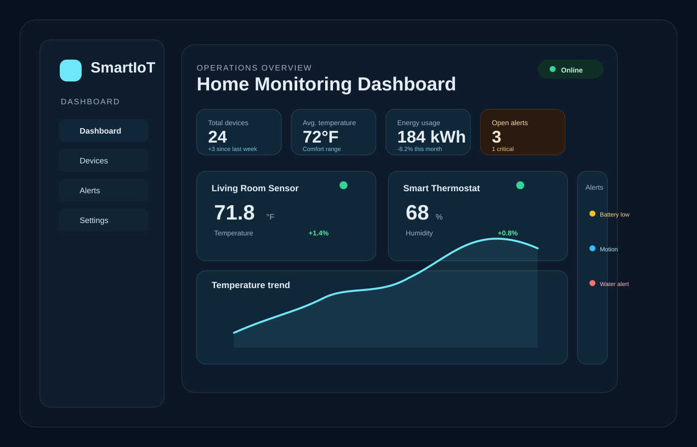

# Smart IoT Device Monitoring Dashboard

A sleek and responsive smart home monitoring dashboard designed for tracking connected devices, environmental metrics, analytics, and alerts in real time.

[](https://developer.mozilla.org/en-US/docs/Web/HTML)
[](https://developer.mozilla.org/en-US/docs/Web/CSS)
[](https://developer.mozilla.org/en-US/docs/Web/JavaScript)
[](LICENSE)

## Live Demo

https://kummarisaradha.github.io/Smart-IoT-Device-Monitoring-Dashboard/

## Screenshot



> The project includes a polished SVG preview asset for quick portfolio use and local presentation.

## Features

- Responsive dark-mode dashboard layout
- Device summary cards with live metric simulation
- Custom canvas-based temperature line chart
- Energy usage bar chart rendered with JavaScript
- Notification panel with dismissible alerts
- Real-time status updates using `setInterval()`
- Clean, modern UI optimized for GitHub portfolio presentation

## Tech Stack

- HTML5
- CSS3
- Vanilla JavaScript
- Canvas API for chart rendering

## Setup & Installation

1. Clone the repository:
   ```bash
   git clone https://github.com/your-username/smart-iot-dashboard.git
   ```
2. Navigate into the project folder:
   ```bash
   cd smart-iot-dashboard
   ```
3. Open the project in your browser:
   - Simply open `index.html` in a browser, or
   - Run a local server:
   ```bash
   python -m http.server 8000
   ```
4. Visit:
   ```text
   http://localhost:8000
   ```

## Folder Structure

```text
iot-dashboard/
├── index.html
├── css/
│   └── style.css
├── js/
│   └── script.js
├── assets/
│   └── images/
├── .gitignore
├── README.md
└── LICENSE
```

## Author

### K.Saradha
- GitHub: [@your-username] (https://github.com/kummarisaradha)
- LinkedIn: [Your LinkedIn](https://www.linkedin.com/in/kummari-saradha-a586a4383?utm_source=share_via&utm_content=profile&utm_medium=member_android)
- Portfolio: [https://kummarisaradha.github.io/Smart-IoT-Device-Monitoring-Dashboard/)

## License

This project is licensed under the MIT License. See the [LICENSE](LICENSE) file for details.

---

Built with care for a professional, portfolio-ready IoT dashboard experience.
